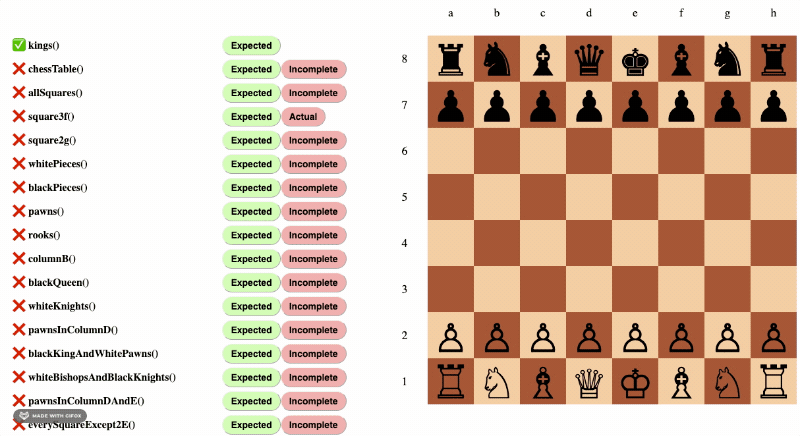
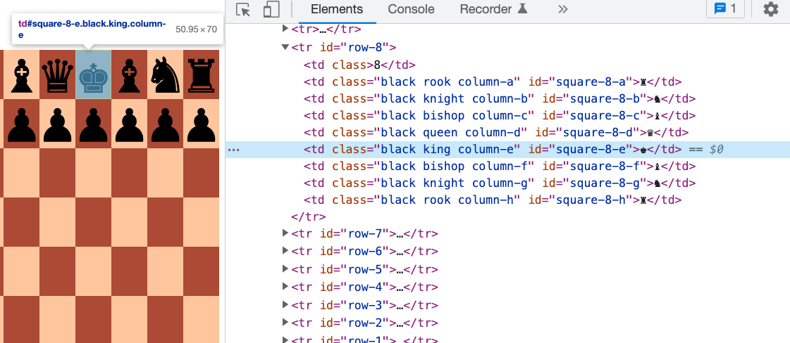
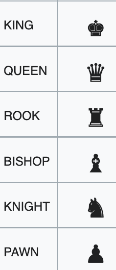

# jQuery Selector Chess

Practice your jQuery selector skills by finding items on the chess board!

Each function in `assignment.js` should return a jQuery object. 

```js
// Example: Select all the kings
function kings() {
    // Kings all have a class="king" attribute
    // The "." selector selects elements by class name
    return $('.king');
}
```

Open index.html in your browser, to test your code. Hover your mouse over the _Expected_ and _Actual_ buttons to see which elements you actually selected, vs which ones we expected you to select:



Use the Chrome Elements panel to see what elements  are available on the DOM



See https://www.w3schools.com/jquery/jquery_ref_selectors.asp
for a full list of jQuery selectors

## Chess Piece Names

